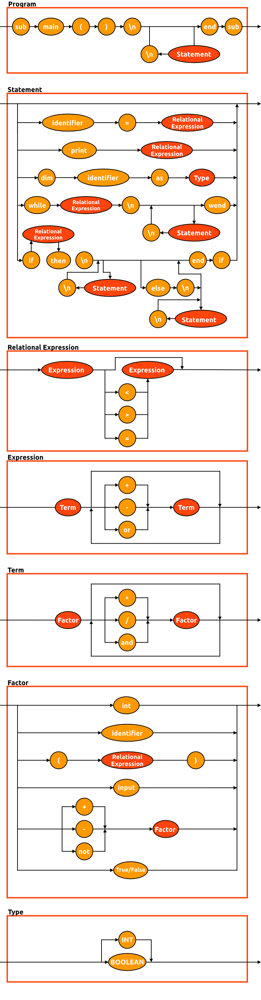

# VBA Compiler

## Diagrama Sintático


## EBNF
- comandos = “Begin”, “\n”, comando, “\n”, { comando, “\n” }, “End” ;
- comando = atribuição | print | comandos ;
- atribuição = identificador, “=”, expressão ;
- expressão = termo, { (“+” | “-”), termo } ;
- termo = fator, { (“*” | “/”), fator } ;
- fator = (“+” | “-”), fator | número | “(”, expressão, “)” | identificador ;
- identificador = letra, { letra | digito | “_” } ;
- número = dígito, { dígito } ;
- letra = ( "a" | ... | "z" | "A" | ... | "Z" ) ;
- dígito = ( "0" | "1" | "2" | "3" | "4" | "5" | "6" | "7" | "8" | "9" ) ;

## Como utilizar
Para utilizar o compilador, rode o arquivo `main.py`, passando como argumento o arquivo **.vbs* a ser compilado. Para testar com o arquivo de teste:
```bash
$ python main.py test_file.vbs
```